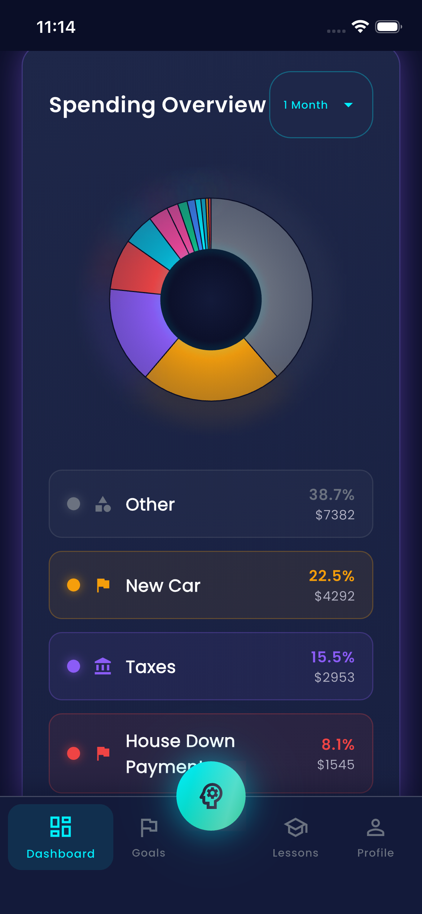
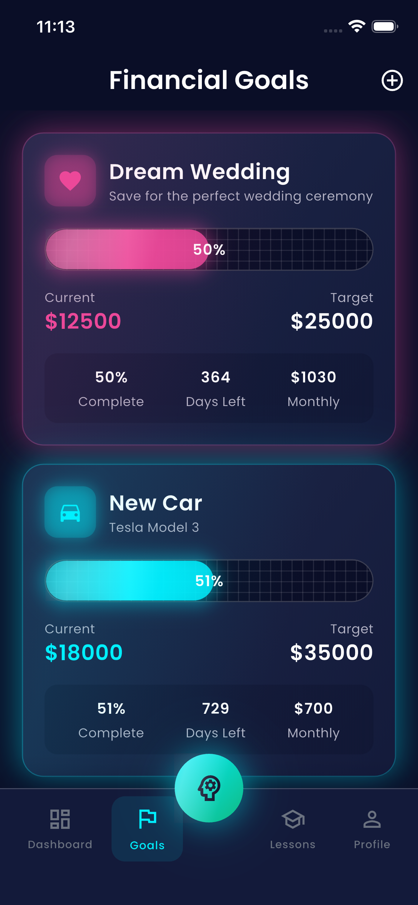

# Puldon AI

A Flutter-based AI-powered financial management application.

## Screenshots

<p align="center">
  
  
  
</p>

<p align="center">
  
  
</p>

## Features

- **Dashboard** - Overview of your financial status
- **Spending Overview** - Track and visualize your spending habits
- **Goals** - Set and monitor your financial goals
- **AI Chat** - Get AI-powered financial advice
- **Profile** - Manage your account settings

## Getting Started

This project is built with Flutter.

### Prerequisites

- Flutter SDK 3.35.7 or higher
- Dart SDK 3.9.2 or higher

### Installation

```bash
# Clone the repository
git clone https://github.com/Salen-Project/puldon-ai.git

# Navigate to the project directory
cd puldon-ai

# Install dependencies
flutter pub get

# Run the app
flutter run
```

## Platform Support

- iOS
- Android
- macOS
- Web
- Linux
- Windows
